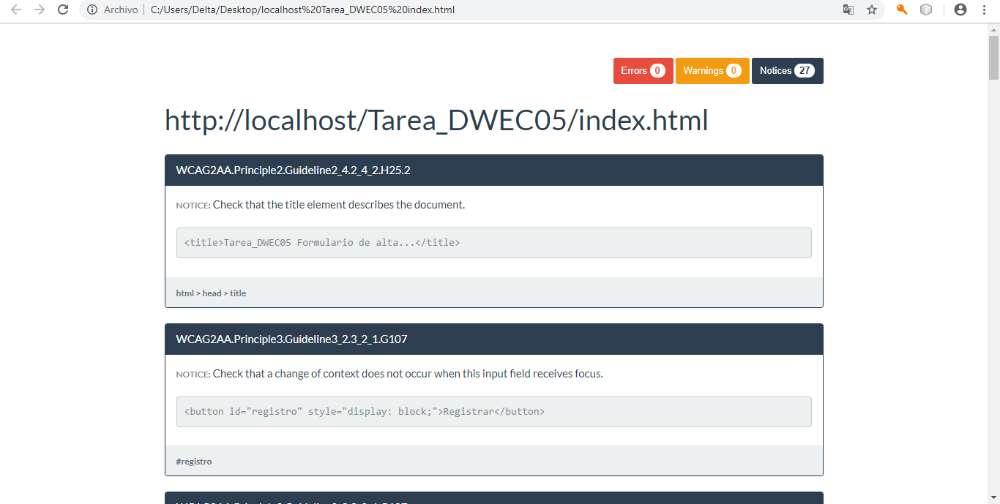

# Tarea DWEC05 - Formulario de alta y login
### Formulario
- Se han incluído dos formularios, de registro y de inicio de sesión.
- El formulario de registro consta de cuatro campos obligatorios, así como un check, los cuales se validan antes de que el formulario puede ser enviado. Los demás campos son opcionales.
- El formulario de inicio de sesión consta de dos campos los cuales son obligatorios y se validan antes de que el formulario pueda ser enviado.

### Cookies
- En primer lugar se crean las cookies nombre y contraseña cuando el usuario se ha registrado correctamente.
- Después se puede iniciar sesión, con los valores de las cookies creadas anteriormente, lo cual crea otra cookie conectado.
- Por último, se puede puede cerrar sesión lo cual borra la última cookie creada.
- Si se cierra el navegador, se borrarán todas las cookies.

### Captura de la herramienta koa11y

### Pruebalo aquí

https://cris907.github.io/FormularioAltayLogin/